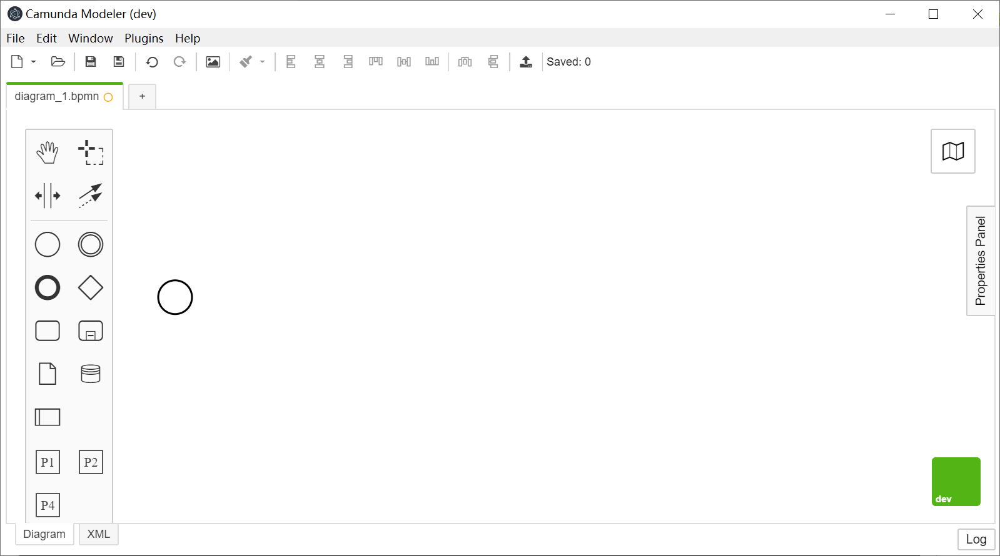

# download sourcecode
download the sourcecode of camunda modeler  from https://github.com/camunda/camunda-modeler

# install dependencies
npm install

# Replace the corresponding codes  with the following codes 

copy  bpmnpallete\PaletteProvider.js  into   \client\node_modules\bpmn-js\lib\features\palette

copy   bpmnpallete\bpmn-embedded.css  into  \client\node_modules\bpmn-js\dist\assets\bpmn-font\css

copy cmmnpallete\PaletteProvider.js  into   \client\node_modules\cmmn-js\lib\features\palette

copy cmmnpallete\cmmn-embedded.css  into  \client\node_modules\cmmn-js\dist\assets\cmmn-font\css

copy dmnpallete\PaletteProvider.js     into  \client\node_modules\dmn-js-drd\lib\features\palette

cooy   dmnpallete\dmn-embedded.css   into   \client\node_modules\dmn-js\dist\assets\dmn-font\css

  
# execute all checks (lint, test and build)
npm run all

# build the application
npm run build

# run the modeler
npm run dev
